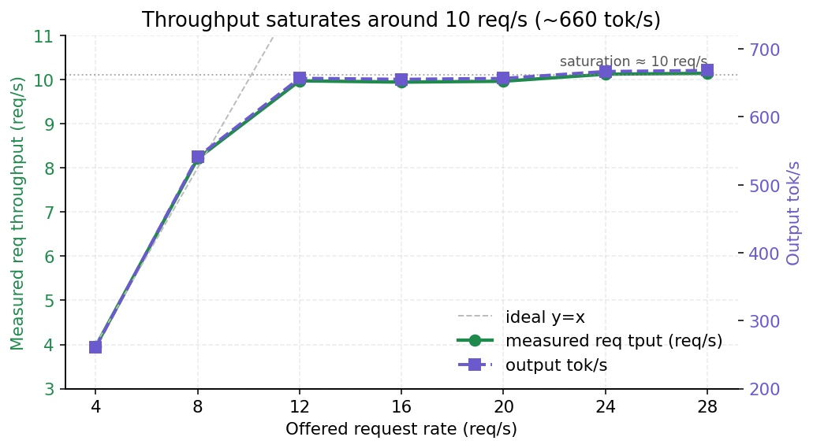
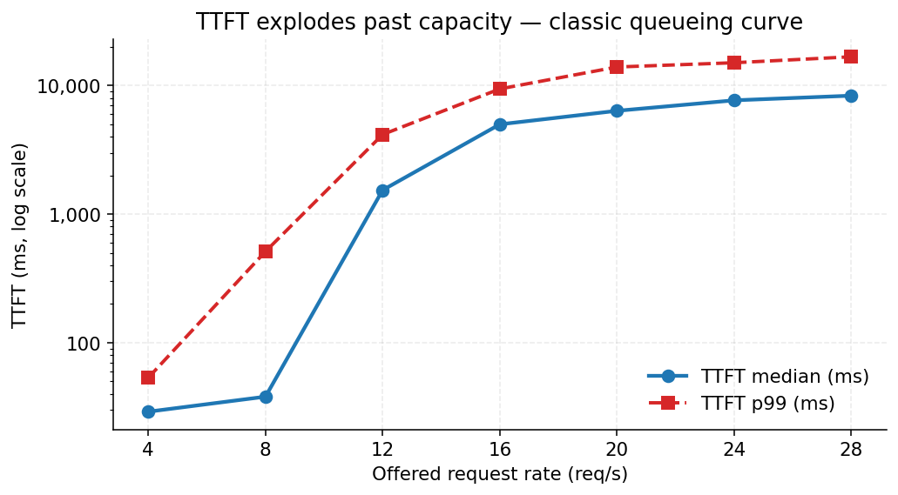
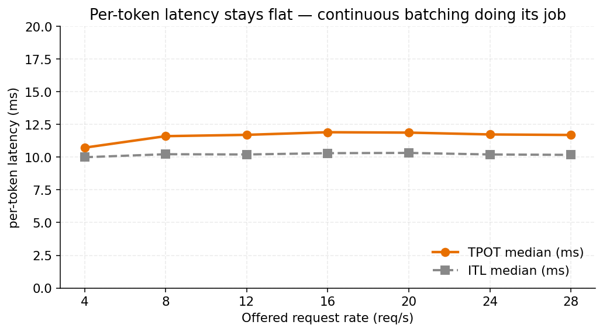

# OmniServe-SGL

【[English](./README.md) | 中文】

一个小而可读、SGLang 风格的在线推理栈，底层用
[OmniServe / QServe](https://github.com/mit-han-lab/omniserve) 的量化 LLM 引擎。
三个协作进程 + ZMQ IPC + 流式
[OpenAI 兼容](https://platform.openai.com/docs/api-reference) HTTP API，直接可
用 SGLang 官方的
[`bench_serving.py`](https://github.com/sgl-project/sglang/blob/v0.4.0/python/sglang/bench_serving.py)
压测，外加一个聊天 UI。

---

## 为什么要写这个仓库

这个项目源自 MIT
[6.5940 TinyML and Efficient Deep Learning Computing（2024 Fall）](https://efficientml.ai/)
课程的 **Project 12：Online Quantized Large Language Model Serving with QServe**。
题目由 QServe 的作者（Haotian Tang、Shang Yang、Yujun Lin）出，大意是：开源的
[QServe](https://github.com/mit-han-lab/qserve) 只放出了*离线* batched 生成脚本
（`qserve_e2e_generation.py`），真实部署需要的是*在线* serving 系统 —— 类似
[vLLM](https://github.com/vllm-project/vllm) 或
[SGLang](https://github.com/sgl-project/sglang) 的架构，外加一个 Gradio demo。
我把它拿下来做，是想借此动手学一下 MLSys / AI infra。

具体来说，`omniserve/qserve_e2e_generation.py` 能说明引擎本身能生成文本，但它
是一个单进程的阻塞脚本。一个真正能用的 serving 栈需要：

- 并发 HTTP 请求，不阻塞引擎的 step loop；
- 每个请求流式输出（SSE）；
- OpenAI 兼容 endpoint，让已有的 SDK / 评测脚本无需改动即可直接跑；
- 把 CPU 活（tokenize / detokenize）和 GPU 活（engine step）干净地拆开，各自跑
  自己的 event loop。

本项目用最少的代码实现上述目标，结构上大致对齐 SGLang 的三进程布局，以便架构能
被清楚地讲出来。

底层的量化后端是 QServe 的 W4A8KV4 量化方案（论文
[arXiv:2405.04532](https://arxiv.org/abs/2405.04532) 里的 "QoQ" 算法）；
`omniserve/` 和 `kernels/` 下所有的量化 kernel、attention backend、模型代码都是
上游原样保留的，我没动。

---

## 整体流程：一个请求，从输入到输出

整个 serving 栈由三个协作进程组成，用 ZMQ PUSH socket 串联起来，每个进程各跑
自己的 `uvloop` 事件循环。

```
           HTTP                      ZMQ PUSH                  ZMQ PUSH
  client ────────►  FastAPI + TokenizerManager ─────►  Router ─────────►  DetokenizerManager
                          (P0: CPU)                  (P1: GPU/engine)          (P2: CPU)
                              ▲                                                       │
                              └────────────── ZMQ PUSH ( BatchStrOut ) ────────────────┘
```

### 请求的完整生命周期

以一次 `/v1/chat/completions` 请求为例，按输入到输出顺序讲：

1. 用户启动 server —— 父进程以子进程方式依次 spawn **DetokenizerManager**
   (P2) 和 **Router** (P1)，通过 `multiprocessing.Pipe` 等两个子进程各自发回
   "ok" 信号；随后在父进程里构造 **TokenizerManager** (P0)、给 FastAPI app
   注册 OpenAI 兼容路由、最后启动 Uvicorn。每个进程各自跑一个无限的
   `asyncio`/`uvloop` 事件循环。

2. 用户向 server 发送 `POST /v1/chat/completions`。Uvicorn 把请求分发到
   `openai_api.py` 里注册的 `chat_completions` 路由。

3. `chat_completions` 把请求体解析为 `ChatCompletionRequest`，用 HF tokenizer
   的 `apply_chat_template(..., add_generation_prompt=True)` 把聊天历史渲染
   成 prompt 文本 + 对应的 `input_ids`；然后计算
   `strip_prefix = tokenizer.decode(input_ids)`；构造 `SamplingParams`（自动
   注入模型自己的 chat 停止 token id）；最后调用
   `TokenizerManager.generate_request(...)`。

4. `TokenizerManager.generate_request` 把请求打包成
   `TokenizedGenerateReqInput(rid, input_ids, sampling_params, stream)`，通过
   PUSH socket 发给 Router；本地分配一份
   `ReqState(strip_prefix, prev_text="", out_list=[], event=asyncio.Event())`
   放到 `rid_to_state[rid]`；然后 `await state.event.wait()` 循环拿新帧回吐给
   HTTP handler。

5. Router 的事件循环（P1 里，和 `LLMEngine` 共进程）：
   - `loop_for_recv_requests` 从 ZMQ 收 `TokenizedGenerateReqInput`，追加到
     `recv_reqs`。
   - `loop_for_forward` 每个 tick：
     - `_admit_new_requests()` —— 对每个待入队的请求，调用
       `llm_engine.add_request(input_ids, sampling_params, ...)`，拿到内部的
       整数 `seq_id`，并把
       `seq_id_to_rid[seq_id] = rid` 和 `seq_id_to_input_len[seq_id]` 都记下。
     - `outs = self.llm_engine.step()` —— 一次前向：新请求做 prefill、running
       请求出一个 decode token，全部在一次 GPU 调用里融合完成（continuous
       batching / IFB）。
     - `_send_step_outputs(outs)` —— 把 `seq_id → rid` 翻回外部 id、把 prompt
       前缀从累计 tokens 里剥掉，然后通过 ZMQ 发一个 `BatchTokenIDOut` 给
      DetokenizerManager。

6. DetokenizerManager 的 `handle_loop` 收到 `BatchTokenIDOut`，要么 (a) 当请求
   已经 finished 时直接用引擎给出的权威 `final_text`，要么 (b) 对中间帧把累计
   的生成 tokens 重新 decode 一遍；把结果包成 `BatchStrOut(rids, output_strs,
   finished)` 推回给 TokenizerManager。

7. TokenizerManager 的后台 `handle_loop` 收到 `BatchStrOut`：从 full text 里
   strip 掉 `state.strip_prefix`（避免 chat 前缀泄漏到输出）、计算
   `delta = full_text[len(prev_text):]`、把 `{text, delta, finished, error}`
   push 到 `state.out_list`、更新 `prev_text`、`state.event.set()` —— 这下唤醒
   正在 `generate_request` 里等待的 HTTP handler。

8. `chat_completions` 把每一帧转成 OpenAI 风格的 SSE chunk (`data: {...}\n\n`)
   通过 `StreamingResponse` yield 出去。收到 finished 帧时额外补一个
   `finish_reason="stop"` chunk；如果客户端传了
   `stream_options.include_usage=true`，再多补一个只含 `usage` 的结尾 chunk；
   最后发 `data: [DONE]\n\n`。Uvicorn 逐个 chunk 通过已打开的 HTTP 长连接推
   给客户端。

### 启动 Server（`serving/server.py`）

`server.py` 是进程编排入口。`main()` 跑在父进程里：

1. 用 `argparse.parse_known_args` 拆 CLI。属于 `LLMEngine` 的参数（`--model`、
   `--precision`、`--max-num-seqs` …）打包进 `EngineArgs` 交给 Router 子进程；
   serving 层的参数（`--host`、`--port`、`--router-port`、
   `--detokenizer-port`、`--served-model-name`）留在父进程。
2. 调用 `mp.get_context("spawn").Process(target=start_detokenizer_process,
   args=(detokenizer_port, tokenizer_port, model_path, pipe_writer))` fork P2，
   然后 `_wait_child_ready(pipe_reader)` 阻塞等子进程在 pipe 上写回 `"ok"`
   （或异常 traceback）。
3. P1 同样套路：`Process(target=start_router_process, args=(engine_args,
   router_port, detokenizer_port, pipe_writer))`。P1 起得很慢 —— 里面的
   `LLMEngine.from_engine_args(...)` 要加载权重、分配 KV cache、预热 CUDA
   kernel，然后才会发 `"ok"`（8B 量化模型一般 30–90 秒）。
4. 父进程里构造 `TokenizerManager`。它绑自己的 ZMQ socket（PUSH 到 Router、
   PULL 从 DetokenizerManager），并在 Uvicorn 的 event loop 上挂一个
   `handle_loop` 的后台 task。
5. 调 `register_openai_routes(app, tokenizer_manager, served_model_name)` 注册
   `/v1/models`、`/v1/completions`、`/v1/chat/completions`；原生的 `/generate`
   和 `/flush_cache` 直接在 `server.py` 里挂到 `app`。
6. 跑 `uvicorn.run(app, host=..., port=...)`。父进程退出时在 `finally` 里把两
   个子进程 terminate 掉。

这里用 `spawn`（而不是 `fork`）是为了让 Router 子进程继承不到父进程里任何已打
开的 CUDA context，避免 GPU driver 被初始化两次。

### HTTP 请求分发（`serving/openai_api.py`）

`register_openai_routes` 挂了三个 endpoint：

- `GET /v1/models` —— 返回 `--served-model-name`。
- `POST /v1/completions` —— 原生文本补全，支持 `prompt`、`max_tokens`、
  `temperature`、`top_p`、`stop`、`stream`、`stream_options`、`echo`、
  `ignore_eos`。
- `POST /v1/chat/completions` —— 带流式的 chat 补全。

对于 chat completions，具体流程是：

1. 进来的 JSON 被解析成 `ChatCompletionRequest`（Pydantic）。
2. `tokenizer.apply_chat_template(messages, tokenize=False,
   add_generation_prompt=True)` 把聊天历史渲染成一串 prompt 文本；再来一次
   `tokenize=True` 拿到对应的 `input_ids`。两次都算出来，是为了让我们在 HTTP
   侧看到的 id 和引擎内部看到的完全一致。
3. `strip_prefix = tokenizer.decode(input_ids)` 是引擎自己对 prompt 部分
   `tokenizer.decode(all_ids)` 时会给出的前缀字符串 —— 第 7 步里从引擎的完整
   文本里把它剥掉，就得到干净的 assistant 输出。
4. `_build_sampling_params(...)` 构造 `SamplingParams`，并注入
   `chat_stop_token_ids`（启动时由 `_resolve_chat_stop_token_ids(tokenizer)`
   一次性查好 —— 在词表里找 `<|eot_id|>`、`<|im_end|>`、`</s>` 等）。如果客户
   端传了 `ignore_eos=true`，也会转发给引擎。
5. 流式：路由 `async for` 迭代
   `tokenizer_manager.generate_request(..., input_ids=input_ids,
   strip_prefix=strip_prefix)` 的帧，用 `_chat_chunk(...)` 把每一帧转成一个
   chat chunk yield 出去。末帧补一个 `finish_reason="stop"` chunk；
   `stream_options.include_usage=true` 时在 `[DONE]` 之前额外补一个
   `{choices: [], usage: {...}}` 结尾 chunk（OpenAI spec）。
6. 非流式：路由 await 最后一帧、对文本跑 `_strip_trailing_specials`（清掉
   decode 时没干掉的字面 special token），返回一个 `ChatCompletion` 形状的
   JSON，含算好的 `usage`。

### TokenizerManager（`serving/tokenize_manager.py`）

和 FastAPI 同进程。负责维护每个请求的状态。

**初始化**
- 建两个 `zmq.asyncio` socket：PUSH 给 Router、PULL 从 DetokenizerManager。
- 加载 HF `AutoTokenizer`。
- 在 event loop 上挂一个 `handle_loop` 后台 task。
- 维护 `rid_to_state: Dict[str, ReqState]`。

**`generate_request(prompt, sampling_params, stream, rid, input_ids=None,
strip_prefix=None)`** —— 每个 HTTP handler 都会调它。

1. 如果没传 `input_ids`，就用 HF `tokenizer.encode` tokenize `prompt`。（chat
   路由自己会先用 `apply_chat_template`，所以 chat 调进来时 `input_ids` 和
   `strip_prefix` 都是直接传进来的。）
2. 打包成 `TokenizedGenerateReqInput(rid, input_ids, sampling_params, stream)`
   通过 ZMQ PUSH 发给 Router。
3. 分配 `ReqState(strip_prefix, prev_text="", out_list=[],
   finished=False, error=None, event=asyncio.Event())`，挂到
   `rid_to_state[rid]`。
4. 循环：`await state.event.wait()`；从 `out_list` 里吐出最新帧；清空
   `out_list` 和 `event`。遇到 `state.finished` 就 break，并从
   `rid_to_state` 里把这一项删掉。

**`handle_loop`** —— 后台 task，从 DetokenizerManager 持续拉 `BatchStrOut`。

1. `recv_obj = await recv_from_detokenizer.recv_pyobj()`。
2. 对每个 `(rid, full_text, finished, error)`：
   - 查 `state = rid_to_state[rid]`；如果已经被注销就跳过。
   - 收到 finished 帧时从 `full_text` 前面 strip 掉 `state.strip_prefix`（不
     让 chat 前缀泄漏到输出里）。
   - 算 `delta = full_text[len(state.prev_text):]`。
   - 把 `{"text": full_text, "delta": delta, "finished": finished,
     "error": error}` 追加到 `state.out_list`；更新 `prev_text`；置
     `state.finished = finished`；`state.event.set()`。

### Router（`serving/router.py`）—— 占着 GPU 的那个进程

跑在自己的子进程里（由 `server.py` spawn 出来），事件循环在
`start_router_process` 里启动。两个 async task 并排跑：
`loop_for_recv_requests` 和 `loop_for_forward`。

**初始化**（在 `start_router_process` 里）

1. 构造唯一的 `LLMEngine`：`LLMEngine.from_engine_args(engine_args)`。这一步
   慢（~30–90 秒）。
2. 绑两个 ZMQ socket：PULL 从 TokenizerManager、PUSH 给 DetokenizerManager。
3. 初始化 `recv_reqs: List[TokenizedGenerateReqInput] = []`、
   `seq_id_to_rid: Dict[int, str] = {}`、
   `seq_id_to_input_len: Dict[int, int] = {}`。
4. 通过 `mp.Pipe` 把 `"ok"` 发回父进程，然后启动两个 task。

**`loop_for_recv_requests`** —— 紧凑循环
`await recv_from_tokenizer.recv_pyobj()`，结果追加到 `self.recv_reqs`。它完全
不会阻塞 engine step，所以新请求不用等当前 GPU step 结束就能进来排队。

**`loop_for_forward`** —— engine step 循环：

1. `_admit_new_requests()`：
   - 把 `recv_reqs` 整个 swap 到本地列表（避免一边遍历一边被追加）。
   - 对每个 `TokenizedGenerateReqInput`：
     - `seq_id = llm_engine.add_request(input_ids, sampling_params, ...)`。
     - 记下 `seq_id_to_rid[seq_id] = rid` 和
       `seq_id_to_input_len[seq_id] = len(input_ids)`。
2. `outs = self.llm_engine.step()` —— 在 GPU 上跑一次 IFB step。返回
   `List[dict]`，每个 active 序列一项：
   `{"seq_id": int, "tokens": List[int], "text": Optional[str],
   "finished": bool}`。注意这里的非对称：`tokens` 是整个 id 序列（prompt + 目前
   为止生成的 token），`text` 只在 `finished=True` 时才会有值（此时它是权威
   的完整 decode，不做 `skip_special_tokens`）。
3. `_send_step_outputs(outs)` —— 构造 `BatchTokenIDOut`：
   - 对每个 `o`：
     - `seq_id = o["seq_id"]`；从 `seq_id_to_rid` 翻回 `rid`；查
       `prompt_len = seq_id_to_input_len[seq_id]`。
     - 如果 `o["finished"]`：push `rid`、`output_tokens=[]`、
       `final_text=o["text"]`、`finished=True`，并把两个 map 里对应项 `pop`
       掉。
     - 否则：`gen = o["tokens"][prompt_len:]`（把 prompt 剥掉的累计生成 id）；
       push `rid`、`output_tokens=gen`、`final_text=None`、`finished=False`。
   - `send_to_detokenizer.send_pyobj(BatchTokenIDOut(...))`。

为什么要有 `seq_id → rid` 这层映射？因为 `LLMEngine` 内部用递增的整数 id，而
外部世界（HTTP 客户端、我们自己的 `rid_to_state`）用 UUID 字符串。如果不做这
层翻译，引擎复用小 id 时就会在多请求间撞车。

### LLMEngine step —— continuous batching 的真身（上游 OmniServe）

`LLMEngine.step()` 是 OmniServe 的 in-flight batching 原语。它一次调用就做：

1. 按 `--max-num-seqs`、`--max-num-batched-tokens`、`--chunk-prefill-size` 决
   定这一步跑哪些 waiting/running 序列。
2. 跑一次融合的 GPU 前向：把新 admit 进来的序列的 prefill 和已经在跑的序列
   的一个 decode step 拼一起。这就是 continuous batching 的那个点 —— 新请求
   不用等旧 batch 跑完。
3. 跑 sampler。当 `temperature < 1e-5` 或 `top_p < 1e-8` 或 `top_k == 1` 时
   走 greedy (`torch.argmax`)；否则走 `softmax + multinomial`。
   `SamplingParams` 里的 `ignore_eos=True`、`stop`、`stop_token_ids` 都是在
   这里处理的。
4. 判断终止；碰到 max-tokens / EOS / stop 字符串的序列会被标为
   `finished=True`，并在返回的 dict 里带上权威的完整 `text` decode。

我们只通过 `add_request`、`step`、`abort` 和引擎打交道 —— 里面的调度器、KV
cache、kernel 我们一个都没改。

### DetokenizerManager（`serving/detokenize_manager.py`）

跑在 P2。这个进程存在的全部意义就是让 Router 保持 GPU 纯净 —— HF tokenizer
是一坨 Python 代码，如果塞在 Router 里会从 engine step loop 里偷走 CPU 时间。

**初始化**
- 加载 HF `AutoTokenizer`（只 CPU，不碰 CUDA）。
- 绑 ZMQ：PULL 从 Router、PUSH 给 TokenizerManager。
- 通过父 pipe 发 `"ok"`。

**`handle_loop`**

1. `batch = await recv_from_router.recv_pyobj()` —— 一个 `BatchTokenIDOut`。
2. 对每个 `(rid, tokens, finished, final_text)`：
   - 如果 `final_text is not None`（请求已 finished）：直接用它 —— 引擎已经
     跑过 `tokenizer.decode(all_ids)`，那次 decode 是权威的（BPE merge、
     special token 都处理对了）。
   - 否则（中间流式帧）：`output_str =
     tokenizer.decode(tokens, skip_special_tokens=False)`。这里的 `tokens` 只
     是生成部分（Router 已经把 prompt 剥掉了）；`skip_special_tokens=False`
     是必须的，否则 TokenizerManager 那边的 `strip_prefix` 逻辑和字符对不齐。
3. `send_to_tokenizer.send_pyobj(BatchStrOut(rids, output_strs, finished))`。

### IPC 协议（`serving/io_struct.py`）

三个 pickle-safe 的 dataclass 在 ZMQ 上穿梭：

- `TokenizedGenerateReqInput(rid: str, input_ids: List[int],
  sampling_params: SamplingParams, stream: bool)` —— TokenizerManager → Router。
- `BatchTokenIDOut(rids: List[str], output_tokens: List[List[int]],
  finished: List[bool], final_text: List[Optional[str]],
  errors: List[Optional[str]])` —— Router → DetokenizerManager。
- `BatchStrOut(rids: List[str], output_strs: List[str],
  finished: List[bool], errors: List[Optional[str]])` ——
  DetokenizerManager → TokenizerManager。

批次里能装多个 `rid`，因为 Router 的 `step()` 一次 GPU 调用可以同时推进/结束
多个序列。

**不在本项目范围内（未实现）**：speculative decoding、prefix / radix cache、
比引擎本身提供的更进一步的多 GPU TP、tool / function calling。

---

## 仓库结构

在线推理相关的新增代码全部落在仓库根目录和 `serving/` 下；其他都是原样保留
的 OmniServe 引擎。

```
serving/                       # NEW – 三进程 serving 栈
├── server.py                  #   入口 – spawn P2、P1，启动 FastAPI
├── tokenize_manager.py        #   P0 工具（tokenize + per-request state）
├── router.py                  #   P1 – LLMEngine loop
├── detokenize_manager.py      #   P2 – token-ids → strings
├── openai_api.py              #   /v1/models, /v1/completions, /v1/chat/completions
├── io_struct.py               #   pickle-safe IPC dataclasses
└── log_utils.py               #   vlog / ilog / elog (SERVING_VERBOSE 环境变量)

bench_serving.py               # NEW – SGLang v0.4.0 benchmark 脚本，原文件未改
gradio_ui.py                   # NEW – /v1/chat/completions 的 chat UI
gradio_completion.py           # NEW – 基于原生 /generate 的简陋 UI

omniserve/                     # 原始引擎 (LLMEngine, kernels, modeling…)
kernels/                       # 原始 CUDA kernel
qserve_e2e_generation.py …     # 原始 offline 脚本，没改
```

---

## 快速上手

### 1. 启动 server

在仓库根目录（也就是本目录）跑：

```bash
export MODEL_PATH=./qserve_checkpoints/Llama-3-8B-Instruct-QServe

NUM_RETRIEVAL_GPU_PAGE_BLOCKS=4000 \
NUM_STREAMING_GPU_PAGE_BLOCKS=0 \
CHUNK_PREFILL_SIZE=65536 \
python -m serving.server \
    --model "$MODEL_PATH" \
    --quant-path "$MODEL_PATH" \
    --precision w4a8kv4 \
    --group-size -1 \
    --ifb-mode \
    --kv-quant-granularity fine_grained \
    --max-num-seqs 8 \
    --max-num-batched-tokens 262144 \
    --chunk-prefill-size 8192 \
    --sparse-decode-mode 0 \
    --served-model-name llama-3-8b-qserve
```

8B W4A8KV4 模型首启要 ~3–4 分钟（权重加载 + KV cache 分配 + CUDA kernel
预热）。看到 `[server] listening on http://127.0.0.1:8000` 再发请求。

`--sparse-decode-mode 0` 在搭配 `--kv-quant-granularity fine_grained` 时**必须
加**：否则引擎会走 dynamic-sparse 的 decode kernel 路径，而这条路径有
`tokens_per_block % (K_LOOP_UNROLL * K_PER_ITER) == 0` 的约束，在标准 KV-cache
配置下过不了，第一个 decode step 立刻 assert 挂掉。

置 `SERVING_VERBOSE=1` 可以看到每个请求的 IPC trace。

### 2. curl 打一下

```bash
# 原生 endpoint（不是 OpenAI 形状）
curl -N http://127.0.0.1:8000/generate \
  -H 'Content-Type: application/json' \
  -d '{"prompt":"The capital of France is","max_new_tokens":16,"stream":true}'

# OpenAI chat，流式
curl -N http://127.0.0.1:8000/v1/chat/completions \
  -H 'Content-Type: application/json' \
  -d '{"model":"llama-3-8b-qserve","stream":true,
       "messages":[{"role":"user","content":"Write a haiku."}]}'
```

### 3. 用 OpenAI SDK

```python
from openai import OpenAI

client = OpenAI(base_url="http://127.0.0.1:8000/v1", api_key="not-needed")
resp = client.chat.completions.create(
    model="llama-3-8b-qserve",
    messages=[{"role": "user", "content": "What is the capital of France?"}],
    max_tokens=16,
)
print(resp.choices[0].message.content)   # "Paris."
```

### 4. 浏览器聊天

```bash
python gradio_ui.py        # http://127.0.0.1:7860
```

---

## 用 SGLang 官方脚本压测

我们故意不自己写压测脚本 —— 我们对齐的就是 SGLang
[`bench_serving.py`][bench] 期望的 OpenAI API 协议，所以他们的脚本直接能用。

[bench]: https://github.com/sgl-project/sglang/blob/v0.4.0/python/sglang/bench_serving.py

仓库里直接放了一份 v0.4.0 的 self-contained 版本：`bench_serving.py`。依赖：
`aiohttp numpy tqdm requests transformers`。

### 跑一次

```bash
python bench_serving.py \
    --backend vllm \
    --host 127.0.0.1 --port 8000 \
    --model llama-3-8b-qserve \
    --tokenizer "$MODEL_PATH" \
    --dataset-name random \
    --num-prompts 20 --max-concurrency 4 \
    --random-input-len 256 --random-output-len 64 \
    --disable-ignore-eos
```

`--backend vllm` 选的是 OpenAI completions 客户端路径（也就是我们对外暴露的
API 形状）。输出样例：

```
============ Serving Benchmark Result ============
Backend:                                 vllm
Max reqeuest concurrency:                4
Successful requests:                     20
Benchmark duration (s):                  2.26
Total input tokens:                      2897
Total generated tokens:                  541
Request throughput (req/s):              8.86
Input token throughput (tok/s):          1282.87
Output token throughput (tok/s):         239.57
Total token throughput (tok/s):          1522.44
Mean E2E Latency (ms):                   390.77
Mean TTFT (ms):                           32.61
P99 TTFT (ms):                            74.24
Median TPOT (ms):                         11.18
Mean ITL (ms):                            11.04
==================================================
```

### 常用 flag

| flag                       | 说明                                                 |
|----------------------------|------------------------------------------------------|
| `--disable-ignore-eos`     | 推荐加。不加的话压测脚本会让 server 忽略 EOS、严格生成 `--random-output-len` 个 token。我们通过 OmniServe sampler 的 `ignore_eos=True` 路径在这个 kernel build 上还没完全验证过；加这个 flag 就让自然 EOS 结束，输出长度分布仍然由数据集决定。 |
| `--disable-stream`         | 请求里发 `stream: false`（方便把 server 端的成本从 SSE 成帧里单独拎出来）。 |
| `--dataset-name sharegpt`  | 更接近真实的长度分布。需要 `--dataset-path` 指向 `ShareGPT_V3_unfiltered_cleaned_split.json`。 |
| `--request-rate 8`         | 按 Poisson 8 req/s 到达，而不是连打。                |
| `--backend sglang`         | 触发 SGLang 原生扩展，包括预热用的 `POST /flush_cache`。我们把这个 endpoint 做成 no-op，所以 `sglang` backend 也能跑；`vllm` backend 更简单。 |

### 并发扫测结果

Llama-3-8B-Instruct W4A8KV4，`--max-num-seqs 8`；300 条随机长度 prompt，
`--random-input-len 256 --random-output-len 128`；Poisson 到达，速率扫
{4, 8, 12, 16, 20, 24, 28} req/s（`--multi --request-rate-range 4,32,4`）：

```bash
python bench_serving.py \
    --backend vllm --host 127.0.0.1 --port 8000 \
    --model llama-3-8b-qserve --tokenizer "$MODEL_PATH" \
    --dataset-name random --num-prompts 300 \
    --random-input-len 256 --random-output-len 128 \
    --multi --request-rate-range 4,32,4 \
    --disable-ignore-eos
```

| 速率 (req/s) | 耗时 (s) | 请求吞吐 (req/s) | 输出吞吐 (tok/s) | 均值 TTFT (ms) | P99 TTFT (ms) | 均值 ITL (ms) | 均值 E2E (ms) |
|---|---|---|---|---|---|---|---|
| 4  | 75.8 | 3.96  | 260.9 | 30.8   | 53.2    | 10.8 | 735.9  |
| 8  | 36.5 | 8.21  | 541.2 | 101.4  | 511.6   | 11.6 | 860.3  |
| 12 | 30.1 | 9.97  | 656.9 | 1787.4 | 4164.6  | 11.7 | 2553.1 |
| 16 | 30.2 | 9.94  | 655.4 | 4839.1 | 9431.8  | 11.9 | 5614.9 |
| 20 | 30.1 | 9.96  | 656.7 | 6570.6 | 13970.2 | 12.0 | 7348.4 |
| 24 | 29.7 | 10.12 | 666.9 | 7480.7 | 15077.8 | 11.8 | 8248.0 |
| 28 | 29.6 | 10.14 | 668.4 | 8240.8 | 16776.8 | 11.7 | 9004.3 |

<p align="center">
  <br>
  <br>
  
</p>

几点观察：

- **请求吞吐在 ~10 req/s（~660 tok/s 输出）左右饱和。** 从 12 req/s 到
  28 req/s，测到的吞吐基本不变 —— 在这个 I/O 长度组合下，引擎已经被
  `--max-num-seqs 8` 压到天花板了。想再往上推，可以调大 `--max-num-seqs` 和
  KV page blocks，代价是 per-step 延迟变高。
- **到达率一旦超过容量，TTFT 立刻起飞。** 4 req/s 时 30 ms，8 req/s 时
  100 ms，12 req/s 时 1.8 秒，28 req/s 时 8.2 秒 —— 教科书式的排队曲线。
  28 req/s 时 P99 TTFT 16.8 秒，也就是请求在队列里坐了这么久才拿到第一个
  token。
- **ITL 在整个扫测里稳定在 ~10–12 ms。** 单序列 decode 吞吐不受队列长度影
  响，这正是 continuous batching 该给的特性：一旦请求进了 running batch，
  后面再来的请求不会拖慢它。
- **负载高时 E2E 几乎就是 TTFT。** 低负载下 E2E ≈ 128 × ITL ≈ 1.3 s（rate=4
  时均值只有 735 ms，是因为不是每条 prompt 都会吐满 128 个输出 token）；一
  旦过了饱和点，E2E 几乎和 TTFT 1:1 —— 排队时间就是成本。

---

## 环境变量

| 名字                 | 默认     | 含义                                             |
|----------------------|----------|--------------------------------------------------|
| `SERVING_VERBOSE`    | `0`      | 置 `1` 打开每个进程里的 per-request vlog trace   |
| `SERVER_URL`         | (见 UI)  | `gradio_ui.py` 连哪个 base URL                   |
| `MODEL_NAME`         | llama-3-8b-qserve | `gradio_ui.py` 里用的 model name         |
| `GRADIO_HOST/PORT`   | 127.0.0.1 / 7860 | UI 绑定地址                              |

在 `LLMEngine` 本身 CLI 之上额外加的 flag：

| flag                    | 含义                                                       |
|-------------------------|------------------------------------------------------------|
| `--host / --port`       | FastAPI 绑定                                               |
| `--router-port`         | TokenizerManager → Router 的 ZMQ 端口（默认 8500）         |
| `--detokenizer-port`    | Router → Detokenizer 的 ZMQ 端口（默认 8510）              |
| `--tokenizer-port`      | Detokenizer → TokenizerManager 的 ZMQ 端口（默认 8520）    |
| `--served-model-name`   | `/v1/models` 返回的名字，也是 `/v1/...` 可接受的 model 名  |

---

## License

Apache 2.0，和上游 [OmniServe](https://github.com/mit-han-lab/omniserve)、
[SGLang](https://github.com/sgl-project/sglang) 一致。见 `LICENSE`。
